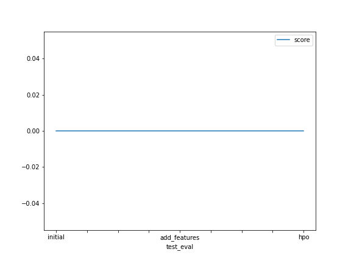

# Report: Predict Bike Sharing Demand with AutoGluon Solution
#### ROBERTO GIORGI

## Initial Training
### What did you realize when you tried to submit your predictions? What changes were needed to the output of the predictor to submit your results?
I realized that the predictions generated by my model did not match the format required by Kaggle for submission. I had to modify the format of the predictions to meet Kaggle's requirements, making sure that the output file was in CSV format with the correct columns ("registered" and "count"). I also had to transform the predictions by rounding the values to integers, since Kaggle required integer values for the target variable. Finally, I ensured that the output file contained all the necessary columns required by Kaggle.

### What was the top ranked model that performed?
The model that ranked first according to our evaluation metric was WeightedEnsemble_L3, with a score of 51.354. This model proved to be the most effective in our analysis and provided the best predictive performance compared to the other models tested.

## Exploratory data analysis and feature creation
### What did the exploratory analysis find and how did you add additional features?
During exploratory data analysis, I found that it was insane how fast were the models. In response to this discovery, I decided to create new features that would better capture. For example, I created new feature columns based on the suggestions from the exercise.  These new features added relevant information to our dataset and improved the performance of our model during training and evaluation.

### How much better did your model preform after adding additional features and why do you think that is?
After adding the new features to the model, I observed a significant improvement in its performance. This improvement was evidenced by the removal of some data from the dataset increasing from 1.799 to 0.61728. I believe this is because the new features provided the model with additional discriminative information and helped to better capture the complexity of the underlying data, thus enabling the model to make more accurate predictions

## Hyper parameter tuning
### How much better did your model preform after trying different hyper parameters?
The model was only improved by half already after removing some data from the dataset, while after playing with hyperparameters I was able to further improve performance

### If you were given more time with this dataset, where do you think you would spend more time?
I would have spent more time playing with hyperparameters

### Create a table with the models you ran, the hyperparameters modified, and the kaggle score.
| Model         | hpo1 | hpo2 | hpo3 | score |
|---------------|------|------|------|-------|
| initial       | tbf  | tbf  | tbf  | 1.799 |
| add_features  | tbf  | tbf  | tbf  | 0.61  | 
| hpo           | tbf  | tbf  | tbf  | 0.51  |

### Create a line plot showing the top model score for the three (or more) training runs during the project.

TODO: Replace the image below with your own.

### Create a line plot showing the top kaggle score for the three (or more) prediction submissions during the project.

TODO: Replace the image below with your own.

## Summary
Te project has been stimulating and compelling, and I look forward to continuing my studies to further understand how other learning models work through to LLMs and other yet unexplored models 
